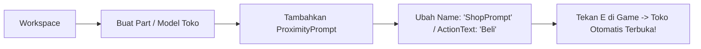

# 🎣 FISH!TUNE — Roblox Rhythm Fishing System

**FISH!TUNE** adalah game pancing ritme inovatif di Roblox yang menggabungkan mekanisme memancing imersif dengan gameplay instrumen musik (**Piano**, **Gitar**, dan **Drum**) berbalut estetika antarmuka *Glassmorphism*.

---

## 📖 DAFTAR ISI
1. [Panduan Setup Roblox Studio (NPC Toko & Pedagang Ikan)](#-1-panduan-setup-roblox-studio)
2. [Panduan Mengganti Joran (Switch Rods)](#-2-panduan-mengganti-joran-switch-rods)
3. [Daftar Joran & Mekanisme Instrumen (Piano, Guitar, Drum)](#-3-daftar-joran--mekanisme-instrumen)
4. [Daftar Tombol & Hotkey Lengkap](#-4-daftar-tombol--hotkey-lengkap)
5. [Mode Testing di Roblox Studio](#-5-mode-testing-di-roblox-studio)
6. [Struktur Folder & Arsitektur](#-6-struktur-folder--arsitektur)

---

## 🛠️ 1. Panduan Setup Roblox Studio

Semua skrip server (`FishingServer.server.lua`) telah dilengkapi dengan **Global ProximityPrompt Listener**. Anda **TIDAK PERLU** menulis skrip baru di dalam NPC atau Part. Cukup buat Model / Part di Workspace Roblox Studio dan pasang `ProximityPrompt` sesuai panduan di bawah ini:

### A. Setup NPC / Stand Toko Peralatan (Joran, Umpan, Tas)



1. Di Roblox Studio, letakkan Part / Model NPC untuk Toko Peralatan di pulau/pantai.
2. Klik kanan pada Part / Model tersebut → **Insert Object** → pilih **`ProximityPrompt`**.
3. Di panel **Properties**, atur nilai berikut:
   - **Name**: `ShopPrompt` *(atau `TokoPrompt`)*
   - **ActionText**: `Buka Toko` *(atau `Beli`, `Shop`, `Toko`)*
   - **ObjectText**: `Toko Samudra`
   - **HoldDuration**: `0.5` *(atau `0` untuk instan)*
   - **MaxActivationDistance**: `10`
   - **RequiresLineOfSight**: `false` *(opsional, agar mudah diakses)*

---

### B. Setup NPC / Lapak Pedagang Ikan (Merchant Jual Ikan)

1. Letakkan Part / Model NPC Pedagang Ikan di dekat dermaga / pasar.
2. Klik kanan pada Part / Model tersebut → **Insert Object** → pilih **`ProximityPrompt`**.
3. Di panel **Properties**, atur nilai berikut:
   - **Name**: `SellPrompt` *(atau `MerchantPrompt`)*
   - **ActionText**: `Jual Semua Ikan` *(atau `Jual Ikan`, `Sell All`)*
   - **ObjectText**: `Pedagang Ikan`
   - **HoldDuration**: `0.5`
   - **MaxActivationDistance**: `10`

> 💡 **Info Otomatis**: Ketika pemain memicu prompt pedagang ikan, seluruh ikan di tas pemain akan langsung terjual dengan kalkulasi harga bobot + mutasi, koin pemain bertambah, dan notifikasi perolehan koin muncul di layar.

---

## 🎣 2. Panduan Mengganti Joran (Switch Rods)

Di FISH!TUNE, **joran yang Anda gunakan menentukan jenis instrumen & mekanisme minigame** yang akan dimainkan saat ikan menyambar (*strike*).

### Langkah Mengganti Joran:
1. Tekan tombol **`[K]`** pada keyboard atau klik tombol HUD **`[ 🛍️ TOKO ]`** di layar.
2. Klik tab **`[ 🎣 Joran Pancing ]`**.
3. Cari joran yang ingin Anda gunakan:
   - Jika joran sudah dimiliki: Klik tombol biru **`[ 🎣 GUNAKAN ]`**.
   - Tombol akan berubah menjadi hijau **`[ ✅ DIGUNAKAN ]`**.
   - Jika joran belum dimiliki: Klik tombol kuning **`[ 💰 BELI ]`** (otomatis terbeli jika koin & level mencukupi).
4. Tutup jendela Toko dengan tombol **`[ ✕ ]`** di pojok kanan atas.
5. Joran baru Anda kini aktif dan siap digunakan untuk memancing!

---

## 🎶 3. Daftar Joran & Mekanisme Instrumen

Setiap joran memiliki statistik Luck, Kekuatan Lemparan, serta **Badge Instrumen** khusus:

| Ikon & Nama Joran | Badge Instrumen | Mekanisme Minigame Irama | Kontrol / Keybind |
| :--- | :--- | :--- | :--- |
| 🎣 **Starter Bamboo Rod** | 🎹 `PIANO` | **Piano Tiles Precision (4-Lane)**<br>Not balok jatuh ke bawah melintasi garis target presisi. Cocok untuk pemula. | **`1`**, **`2`**, **`3`**, **`4`** atau **`A`**, **`S`**, **`K`**, **`L`** |
| 🎣 **Harmonic Tuning Rod** | 🎹 `PIANO` | **Grand Piano Melodic Tiles**<br>Tempo lebih dinamis dengan harmoni melodi klasik. | **`1`**, **`2`**, **`3`**, **`4`** atau **`A`**, **`S`**, **`K`**, **`L`** |
| 🎣 **Acoustic Bamboo Rod** | 🎸 `GUITAR` | **Guitar Fretboard Pattern**<br>Not melodi mengalir horizontal di atas senar bergetar (*vibrating strings*). | **`A`**, **`S`**, **`D`**, **`J`**, **`K`**, **`L`** |
| 🎣 **Carbon Overdrive Rod** | 🎸 `GUITAR` | **Electric Guitar Rock Riff**<br>Pola petikan senar elektrik cepat dengan efek distorsi audio visual. | **`A`**, **`S`**, **`D`**, **`J`**, **`K`**, **`L`** |
| 🎣 **Abyssal Trident Rod** | 🎸 `GUITAR` | **Abyssal Heavy Metal Solo**<br>Pola riff cepat untuk memburu ikan langka kedalaman samudra. | **`A`**, **`S`**, **`D`**, **`J`**, **`K`**, **`L`** |
| 🎣 **Celestial Melody Rod** | 🥁 `DRUM` | **Drum Concentric Beat Timing**<br>Lingkaran gelombang ketukan berdenyut menyatu ke pusat target pad drum. | **`Spasi`**, **`E`**, atau **`Q`** tepat saat lingkaran menyatu |

### 🎯 Panduan Posisi Ketukan Not Piano (Hit Zones):
Di dalam mini-game Piano Tiles, arena permainan kini dilengkapi dengan **Indikator Visual Zona Warna** dan **Legend Bar** di bagian atas:
1. ⭐ **Zona PERFECT (Emas / Gold)**:
   - **Posisi**: Tepat di garis laser target tengah (`HitLine`).
   - **Skor**: **+300 Poin** + Bonus Combo Maksimal.
2. ◆ **Zona GREAT (Biru Muda / Cyan)**:
   - **Posisi**: Area di sekitar garis target (sedikit sebelum / sesudah garis target).
   - **Skor**: **+180 Poin** + Melanjutkan Combo.
3. ● **Zona GOOD (Hijau Emerald)**:
   - **Posisi**: Area terluar saat not mulai memasuki bantalan tuts piano (`ReceptorPad`).
   - **Skor**: **+80 Poin** + Menjaga Progres Tangkapan.
4. ✕ **Garis MISS (Merah)**:
   - **Posisi**: Melewati garis bawah arena. Jika not terlewat atau tuts ditekan saat not belum masuk zona, dinilai **MISS** (Combo Reset & Progres berkurang).

---

## 🎮 4. Daftar Tombol & Hotkey Lengkap

| Tombol / Input | Aksi / Fungsi |
| :--- | :--- |
| **`K`** | Membuka / Menutup **Toko Samudra** (Joran, Umpan, Perluasan Tas, Jual Ikan) |
| **`B`** atau **`I`** | Membuka / Menutup **Tas Inventaris** |
| **`J`** | Membuka / Menutup **FishDex (Ensiklopedia Ikan & Mutasi)** |
| **`E`** atau **Klik Kiri** | Melempar Kail (*Casting*) / Interaksi ProximityPrompt / Pukul Beat Minigame |
| **`1, 2, 3, 4`** / **`A, S, K, L`** | Memainkan tuts **Piano Tiles** |
| **`A, S, D, J, K, L`** | Memainkan senar **Gitar Fretboard** |
| **`Spasi`** / **`Q`** / **`E`** | Memukul pad **Drum Beats** |

---

## 🧪 5. Mode Testing di Roblox Studio

Untuk mempermudah pengujian mekanik tanpa harus grinding dari awal, sistem mendeteksi saat dijalankan di **Roblox Studio** dan otomatis memberikan:
- 💰 **50.000 Koin Saldo Awal**
- ⭐ **Level 20 Karakter**
- 🎣 **Semua Joran Terbuka (Unlocked)**: Siap diganti kapan saja via Toko `[K]`.
- 🪱 **20x Seluruh Jenis Umpan**: Standard Worm, Golden Larva, Magnet Shrimp, dan Melody Jelly.

### Cara Cepat Mengetes Ketiga Instrumen:
1. Jalankan game di Roblox Studio (tekan **Play / F5**).
2. Tekan **`[K]`** untuk membuka Toko.
3. Pilih **StarterRod** (Piano) → Lempar kail ke air → Mainkan Piano Tiles.
4. Buka Toko lagi **`[K]`** → Pilih **BambooRod** (Gitar) → Lempar kail → Rasakan petikan senar gitar.
5. Buka Toko lagi **`[K]`** → Pilih **CelestialMelodyRod** (Drum) → Lempar kail → Rasakan ketukan drum beat!

---

## 📁 6. Struktur Folder & Arsitektur

```
FishTune-Roblox/
├── default.project.json
├── README.md
└── src/
    ├── ReplicatedStorage/
    │   └── Shared/
    │       ├── Config/
    │       │   ├── EconomyConfig.lua            -- Katalog joran, umpan & tier tas
    │       │   ├── PianoTilesConfig.lua         -- Konfigurasi not & visual irama
    │       │   ├── PlayerDataSchema.lua         -- Schema, rekonsiliasi & migrasi data
    │       │   └── ZoneConfig.lua               -- Zona bioma & batasan level
    │       ├── Definitions/
    │       │   └── InstrumentDefinitions.lua    -- Single Source of Truth mapping Joran -> Instrumen (Piano/Guitar/Drum)
    │       ├── Minigames/
    │       │   ├── Rhythm/                      -- Modular Rhythm Router & Engines
    │       │   │   ├── RhythmController.lua     -- Router sentral instrumen
    │       │   │   ├── Piano/                   -- Controller, Session, UI Piano Tiles
    │       │   │   ├── Guitar/                  -- Controller, Session, UI Guitar Fretboard
    │       │   │   └── Drum/                    -- Controller, Session, UI Drum Beat
    │       │   ├── FishDexUI.lua                -- UI Jurnal ensiklopedia ikan
    │       │   ├── InventoryUI.lua              -- UI Tas & slot tangkapan
    │       │   └── ShopUI.lua                   -- UI Toko Samudra & upgrade joran
    │       ├── Network/
    │       │   └── RemoteContract.lua           -- Kontrak protokol jaringan RemoteEvent
    │       └── Systems/
    │           ├── FishingRaritySystem.lua      -- Formula Pity, Level & Bobot Ikan
    │           └── FishingStateMachine.lua      -- State Machine siklus memancing
    ├── ServerScriptService/
    │   └── Services/
    │       ├── EconomyService.lua               -- Transaksi joran, umpan, tas & jual ikan
    │       ├── FishingServer.server.lua         -- Server listener & Global ProximityPrompt handler
    │       ├── FishingSessionService.lua        -- Validasi sesi memancing anti-exploit
    │       └── PlayerDataService.lua            -- DataStore persistence & Studio testing helper
    └── StarterPlayerScripts/
        └── Controllers/
            ├── FishingClient.client.lua         -- Controller utama client, casting & input
            └── ZoneController.client.lua        -- Deteksi zona & banner bioma
```

---

